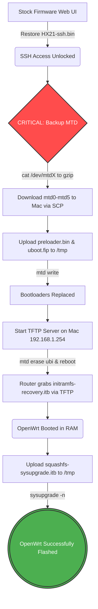

# IMOU HX21 OpenWrt Flashing Workflow

```mermaid
flowchart TD
    A[Stock Firmware Web UI] -->|Restore HX21-ssh.bin| B(SSH Access Unlocked)
    B --> C{CRITICAL: Backup MTD}
    C -->|cat /dev/mtdX to gzip| D[Download mtd0-mtd5 to Mac via SCP]
    D --> E[Upload preloader.bin & uboot.fip to /tmp]
    E -->|mtd write| F[Bootloaders Replaced]
    F --> G[Start TFTP Server on Mac 192.168.1.254]
    G -->|mtd erase ubi & reboot| H[Router grabs initramfs-recovery.itb via TFTP]
    H --> I(OpenWrt Booted in RAM)
    I --> J[Upload squashfs-sysupgrade.itb to /tmp]
    J -->|sysupgrade -n| K(((OpenWrt Successfully Flashed)))

    style C fill:#ff4c4c,stroke:#333,stroke-width:2px,color:#fff
    style K fill:#4caf50,stroke:#333,stroke-width:2px,color:#fff
```
